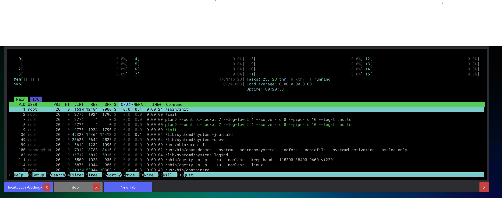
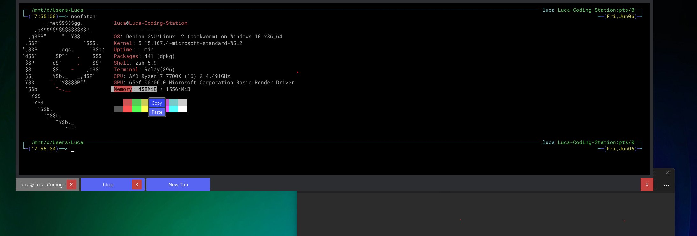

# Frostbyte Terminal and frozen_term

I've always loved Yakuake on my KDE Desktop,
but I've been missing it dearly on other DE's and especially on windows.
Since I had to build a terminal widget for the [rust ui framework iced](https://iced.rs/) anyway,
I needed a test application. And after building the terminal itself,
I just went ahead and kept working on it a bit.

If you want to integrate a terminal into your iced application,
take a look at [the frozen_term widget](frozen_term/Readme.md)

Many thanks also to the developers of [Wezterm](https://github.com/wezterm/wezterm)
as I've stolen all the ANSI and text grid functionality from them.

## Images

## Features

This is still really basic. If you have requests for the widget or application, feel free to open an issue.

- Builtin nerd font, no more installing additinoal fonts for oh-my-posh or oh-my-zsh
- Dropdown Terminal via Hotkey (F12 on Linux, Alt + F12 on Windows)
- Wayland support through iced_layershell (still a bit unstable)
- Multiple Tabs
- Copy and paste via context menu or (Ctrl + Shift + C/V)
- Color support

## Architecture

Frostbyte uses the [rust ui framework iced.](https://iced.rs/)

To understand the code, you'll need to be familiar with the iced basics.

### async_pty

This is just a badly made async wrapper around `portable-pty`.

### frozen_term

This is the iced widget / component pattern.
It handles parsing of the given terminal output and can generate a view to display the terminal.

For Parsing ANSI and managing the character grid, it uses wezterm.

The widget is designed to be plugged into any terminal backend, be it serial, over the network or locally like Frostbyte does.

### frostbyte_term

Frostbyte is the actual application which uses the widget.

It has a submodule `local_terminal` which handles the creation of the pty and
facilitates the required communication between the component and the pty.
If you want to see an example of how to use `frozen_term`, this is the place to look.

## Attribution

This project is licensed under MIT so you can easily use the widget in your own applications.

Developed by [Rahn IT](https://it-rahn.de/).

Thanks to the great developers of
[Iced](https://iced.rs) and [Wezterm](https://wezterm.org/) for making this possible.
